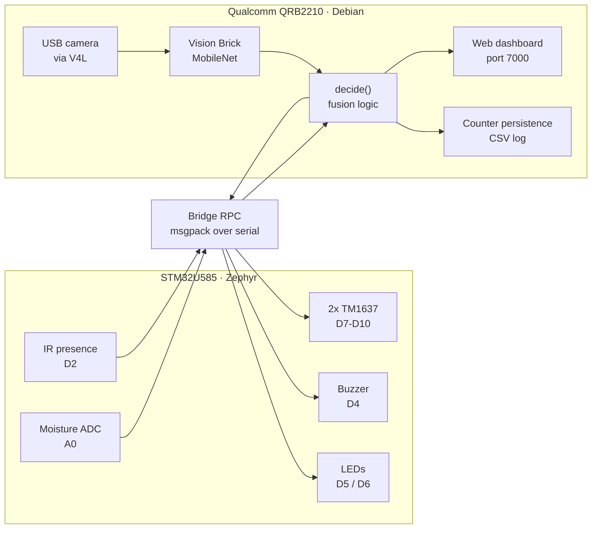
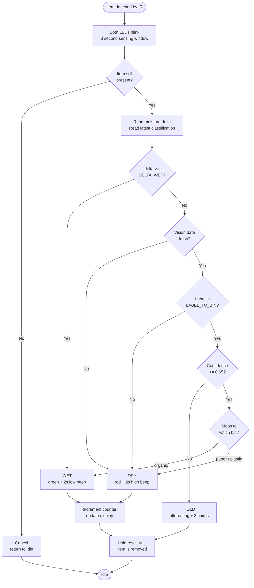
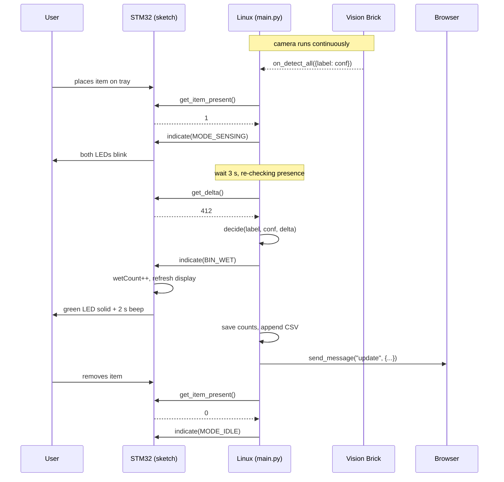
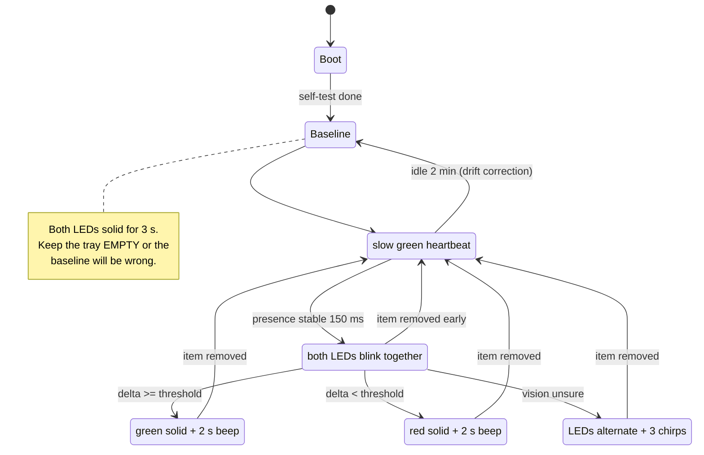

# Smart Waste Segregator — Arduino UNO Q

Places an item on the tray, decides whether it belongs in the **wet** (organic /
compostable) or **dry** (recyclable) stream, and shows the result on LEDs, a
buzzer and two 4-digit counters. A web dashboard gives a live camera preview,
the moisture reading, and a threshold slider.

Built on the UNO Q's dual-brain architecture: the STM32 microcontroller owns
real-time sensing and indication, the Qualcomm processor runs Linux, camera
inference and decision logic, and the two talk over Bridge RPC.

---

## 1. Why sensor fusion

Wet versus dry is a **material property**, not a visual one. This is the whole
design argument, and it cuts both ways:

| Failure | Example | Which sensor catches it |
|---|---|---|
| Looks dry, is wet | Soggy tissue, gravy-smeared wrapper | Moisture |
| Looks wet, is dry | Shiny plastic, glossy paper | Moisture |
| Is dry, is organic | Eggshell, dry leaf, bread crust, nut shell | **Camera only** |
| Unknown object | Anything the model has not seen | Neither — HOLD |

A moisture sensor alone systematically misfiles **dry organic waste** as
recyclable. No amount of threshold tuning fixes it, because the sensor is
measuring the right thing and answering the wrong question. That single row is
why the camera earns its place.

The camera answers *what is it*. The moisture sensor answers *how wet is it*.

### Fusion rules

```
moisture says wet        -> WET    (overrides everything)
dry + vision says organic-> WET    (the case moisture cannot get right)
dry + vision says paper/plastic -> DRY
dry + vision unsure      -> HOLD   (refuse to guess)
dry + vision unknown class -> DRY  (fall back to the physical measurement)
```

**Moisture always overrides.** A wet item in the dry bin contaminates the whole
recycling stream, so no amount of visual confidence outranks a physical
measurement of wetness.

**HOLD is a real answer.** Wet in the dry bin ruins recyclables; dry in the wet
bin ruins compost. When neither signal is confident, refusing to guess is
correct behaviour, not a cop-out.

Note the last two rules differ. "Unsure between known classes" means the model
is hedging — HOLD. "Unknown class entirely" means the model has no concept of
this object — fall back to moisture, which is exactly as good as it was before
vision existed.

---

## 2. System architecture



The split is deliberate. Deterministic timing — LED blink phase, buzzer tone
generation, TM1637 bit-banging — stays on the MCU where a scheduler pause
cannot cause jitter. Heavy, non-deterministic work — camera capture, neural
network inference, file I/O, HTTP — stays on Linux. This is the reason to use
an UNO Q rather than a Raspberry Pi or a plain Uno.

---

## 3. Decision flow



---

## 4. Sort cycle sequence



---

## 5. Indicator state machine



Sensing blinks both LEDs **in phase**; HOLD **alternates** them. Both use two
LEDs, so the phase difference is what keeps them distinguishable at a glance.

---

## 6. Circuit

### Schematic

```
                        ┌─────────────────────────┐
                        │     Arduino UNO Q       │
                        │   (MCU GPIO = 3.3 V)    │
                        │                         │
     ┌──────────────────┤ 3V3                 A0  ├──────────────┐
     │                  │                         │              │
     │  ┌───────────────┤ GND                 D2  ├───────────┐  │
     │  │               │                         │           │  │
     │  │               │                     D3  ├──┐        │  │
     │  │               │                     D4  ├──┼──┐     │  │
     │  │               │                         │  │  │     │  │
     │  │               │                     D5  ├──┼──┼──┐  │  │
     │  │               │                     D6  ├──┼──┼──┼─┐│  │
     │  │               │                         │  │  │  │ ││  │
     │  │               │            D7 D8 D9 D10 ├──┼──┼──┼─┼┼──┼──┐
     │  │               │                         │  │  │  │ ││  │  │
     │  │               │                   USB-C ├── powered hub ── webcam
     │  │               └─────────────────────────┘  │  │  │ ││  │  │
     │  │                                            │  │  │ ││  │  │
     │  │  ┌─────────────────────────────────────────┘  │  │ ││  │  │
     │  │  │  optional manual trigger                   │  │ ││  │  │
     │  │  └──── jumper ────┐                           │  │ ││  │  │
     │  │                   │                           │  │ ││  │  │
     │  ├───────────────────┘                           │  │ ││  │  │
     │  │                                               │  │ ││  │  │
     │  │        BUZZER (3-pin module, has driver)      │  │ ││  │  │
     │  │        ┌──────────┐                           │  │ ││  │  │
     ├──┼────────┤ VCC      │                           │  │ ││  │  │
     │  ├────────┤ GND  I/O ├───────────────────────────┘  │ ││  │  │
     │  │        └──────────┘                              │ ││  │  │
     │  │                                                  │ ││  │  │
     │  │        GREEN LED  (wet)                          │ ││  │  │
     │  │              220 Ω        ▼ anode                │ ││  │  │
     │  │        ┌────▄▄▄▄▄────────▶│────┐                 │ ││  │  │
     │  │        │                       │                 │ ││  │  │
     │  │        └───────────────────────┼─────────────────┘ ││  │  │
     │  ├────────────────────────────────┘                   ││  │  │
     │  │                                                    ││  │  │
     │  │        RED LED  (dry)                              ││  │  │
     │  │              220 Ω        ▼ anode                  ││  │  │
     │  │        ┌────▄▄▄▄▄────────▶│────┐                   ││  │  │
     │  │        │                       │                   ││  │  │
     │  │        └───────────────────────┼───────────────────┘│  │  │
     │  ├────────────────────────────────┘                    │  │  │
     │  │                                                     │  │  │
     │  │        IR OBSTACLE MODULE                           │  │  │
     │  │        ┌──────────────┐                             │  │  │
     ├──┼────────┤ VCC          │                             │  │  │
     │  ├────────┤ GND      OUT ├─────────────────────────────┼──┘  │
     │  │        │          (active LOW)                      │     │
     │  │        └──────────────┘                             │     │
     │  │                                                     │     │
     │  │        MOISTURE MODULE                              │     │
     │  │        ┌──────────────┐                             │     │
     ├──┼────────┤ VCC       AO ├─────────────────────────────┼─────┘
     │  ├────────┤ GND       DO ├── not connected             │
     │  │        └──────────────┘                             │
     │  │                                                     │
     │  │        TM1637 #1 (wet counter)   TM1637 #2 (dry)    │
     │  │        ┌──────────────┐          ┌──────────────┐   │
     ├──┼────────┤ VCC          │      ┌───┤ VCC          │   │
     │  ├────────┤ GND          │      │┌──┤ GND          │   │
     │  │        │ CLK ─── D7   │      ││  │ CLK ─── D9   │◀──┘
     │  │        │ DIO ─── D8   │      ││  │ DIO ─── D10  │
     │  │        └──────────────┘      ││  └──────────────┘
     │  │                              ││
     ├──┼──────────────────────────────┘│
     │  └───────────────────────────────┘
     │
     └─── 3V3 rail                    GND rail ───┘
```

Both power lines feed a breadboard rail — five components want GND and four
want 3V3, and the board has one pin of each.

### Pin map

| UNO Q pin | Connects to | Notes |
|---|---|---|
| **3V3** | + rail → moisture, IR, buzzer, both displays | never 5 V |
| **GND** | − rail → all component grounds, LED cathodes | common ground required |
| **A0** | Moisture module **AO** | not DO — see below |
| **D2** | IR module OUT | active LOW when detected |
| **D3** | jumper to GND *(optional)* | manual trigger, `INPUT_PULLUP` |
| **D4** | Buzzer signal | |
| **D5** | 220 Ω → green LED anode → GND | wet indicator |
| **D6** | 220 Ω → red LED anode → GND | dry indicator |
| **D7 / D8** | TM1637 #1 CLK / DIO | wet counter |
| **D9 / D10** | TM1637 #2 CLK / DIO | dry counter |
| **USB-C** | powered hub → USB webcam | hub needs its own PD supply |

### Electrical notes that matter

**Everything runs at 3.3 V.** The MCU's GPIOs are 3.3 V logic. An IR module
powered from 5 V puts 5 V on its OUT pin whenever nothing is detected — that is
the scenario that damages pins. Moisture sensors on 5 V saturate the ADC and
appear dead.

**Use AO, not DO.** The moisture module's digital output is just a comparator
against whatever its trim pot is set to. The pot does **not** affect AO — if
readings look wrong, the screwdriver is not the answer.

**LED polarity.** Long leg (anode) faces the resistor. Backwards it simply will
not light; nothing is damaged.

**Green may need a smaller resistor.** At 3.3 V, red LEDs drop ~1.8 V leaving
plenty of headroom, but bright green LEDs drop 3.0–3.2 V and barely light
through 220 Ω. If green looks weak next to red, use **100 Ω**.

**Bare buzzers need current help.** A passive piezo can pull ~36 mA, above what
a 3.3 V GPIO should source. A 3-pin buzzer *module* has a driver transistor and
is fine. A bare 2-pin buzzer needs a 100 Ω series resistor or an NPN transistor.

**The USB-C port cannot power devices.** It is a Power Delivery *sink* only, so
the camera needs a hub with its own supply. The 5 V pin is an output; the board
is powered from USB-C PD or Vin (7–24 V) only.

---

## 7. Bill of materials

| Item | Notes |
|---|---|
| Arduino UNO Q | 2 GB or 4 GB |
| USB webcam (UVC) | 720p is plenty |
| **Powered** USB-C hub + PD supply | not optional |
| Capacitive or resistive soil moisture module | capacitive lasts longer |
| IR obstacle module | 3-pin, active LOW |
| 2 × TM1637 4-digit displays | one per stream |
| Buzzer (active or passive) | 3-pin module preferred |
| Green + red LED | blue instead of red matches Indian bin colours |
| 2 × 220 Ω resistors | 100 Ω if green is dim |
| Breadboard + jumpers | for the power rails |

---

## 8. Software layout

```
waste-sorter/
├── app.yaml                 Brick manifest (App Lab generates this)
├── README.md
├── assets/
│   └── index.html           dashboard: camera, delta, slider, log
├── python/
│   ├── main.py              fusion, persistence, dashboard, preview
│   ├── bringup.py           calibration harness (no Bricks)
│   ├── idle.py              no-op Python side for sketch-only testing
│   └── requirements.txt     intentionally empty — see the file
└── sketch/
    ├── sketch.ino           sensing, LEDs, buzzer, counters
    └── sketch.yaml          FQBN and libraries
```

### Build flags in `sketch.ino`

| Flag | Meaning |
|---|---|
| `STANDALONE_MODE` | 1 = MCU decides alone (moisture only, no Python). 0 = Linux drives. |
| `REQUIRE_IR` | 1 = only IR or the D3 jumper can start a decision. 0 = a moisture shift can too. |
| `BUZZER_ACTIVE` | 1 = active buzzer (has oscillator). 0 = passive piezo (waveform generated in software). |
| `SENSOR_LOWER_IS_WETTER` | 1 for most modules. Flip if wet readings come out higher. |

`tone()` is deliberately unused — its Zephyr support is unconfirmed, so the
passive path generates the square wave by hand.

---

## 9. Bridge RPC contract

Every function is registered with `provide_safe()`, **not** `provide()`.
`provide()` dispatches on a background RPC thread where GPIO and ADC calls fail
intermittently; `provide_safe()` queues the callback to run in `loop()` context.

| RPC | Args | Returns | Purpose |
|---|---|---|---|
| `get_item_present` | — | 0/1 | debounced presence |
| `get_moisture` | — | raw ADC | current reading |
| `get_delta` | — | int | baseline − raw (positive = wetter) |
| `get_baseline` | — | int | empty-tray reference |
| `recalibrate` | — | int | re-measure baseline |
| `indicate` | mode | mode | 0=WET 1=DRY 2=HOLD 3=IDLE 4=SENSING |
| `get_wet_count` / `get_dry_count` | — | int | current counts |
| `set_wet_count` / `set_dry_count` | int | int | restore after reboot |
| `reset_counts` | int | 0 | zero both |
| `set_delta_present` / `set_delta_wet` | int | int | live threshold tuning |

Mode ids must stay identical in `sketch.ino` and `main.py`. A mismatch fails
silently.

---

## 10. Setup

1. Wire per section 6. Double-check 3V3, not 5 V.
2. Copy the app to `~/ArduinoApps/` on the board, or create it in App Lab and
   paste the files in.
3. Add two Bricks via **Add Brick**: *Video Image Classification* and
   *WebUI - HTML*. Do **not** also add Video Object Detection — both bind port
   4912 and the second one fails to start.
4. Attach the powered hub and camera. App Lab will no longer see the board over
   USB — switch to **Network mode**.
5. Set `STANDALONE_MODE` to **0** in `sketch.ino`.
6. Run. Dashboard at `http://<board-ip>:7000`.

### Bring-up order

Do not wire everything and run the full app first.

| Stage | What | Proves |
|---|---|---|
| 0 | LEDs only, `STANDALONE_MODE 1` | boot self-test, LED polarity |
| 1 | Add IR | presence detection, trim pot |
| 2 | Add moisture, run `bringup.py` | sensor responds, threshold |
| 3 | Add buzzer and displays | indication complete |
| 4 | `STANDALONE_MODE 0`, add Bricks | camera, dashboard, fusion |

At the end of stage 3 you have a **working moisture-only sorter** — a
demonstrable product before the camera is involved at all.

---

## 11. Calibration

The threshold is a **delta**, not an absolute reading. Absolute values drift
with supply voltage, temperature and sensor variation; a delta cancels all of
that because the baseline drifts with it. The board re-measures its baseline at
every boot and after two minutes idle.

The Python console prints a live bar:

```
delta  412 |###########################             | peak  412 thr  150 -> WET  [item]
```

1. Idle 15 s with the tray empty. Delta should sit near zero. Wandering more
   than ~15 counts means a loose connection — fix that first.
2. Place several dry items. Note where the deltas cluster.
3. Place several wet items. Note that cluster.
4. Set `DELTA_WET` between them, biased toward the wet side.

The dashboard slider does the same thing without an edit-and-rerun cycle.

---

## 12. Signal reference

| LEDs | Sound | Meaning |
|---|---|---|
| Brief green flash every 2 s | — | idle, ready |
| Both blink together, 3 s | — | sensing |
| Green solid | 2 s low beep | WET |
| Red solid | 2 s higher beep | DRY |
| Both alternating, fast | 3 quick chirps | HOLD — needs a human |
| Both solid, 3 s | — | measuring baseline, keep tray empty |
| 3 alternating flashes at boot | 1 chirp | self-test |

Green for wet matches the Indian municipal convention: green bin =
biodegradable, blue = dry recyclable.

---

## 13. Troubleshooting

Every entry here is a problem that actually occurred during this build.

| Symptom | Cause |
|---|---|
| `ImportError: libGL.so.1` | app venv picked up full `opencv-python`, shadowing the container's headless build. **Fix:** `rm -rf ~/ArduinoApps/<app>/.cache/.venv`. Do not pin opencv — the board's build has a local version tag that does not exist on PyPI. |
| `web_ui Brick not found` | usually a *symptom* of the libGL failure — `web_ui` imports the camera stack indirectly. |
| `Bind for :::4912 failed` | both vision Bricks installed. Remove one. |
| `no camera device found` | USB controller booted in device mode. Check `cat /sys/kernel/debug/usb/4e00000.usb/mode`; fix with `echo host \| sudo tee` that path. Permanent fix: update the board image. |
| Camera works, `lsusb` empty | hub not externally powered. |
| `/dev/video0` exists but no webcam | that is the Qualcomm Venus encoder, not your camera. |
| Servo/GPIO works intermittently | used `provide()` instead of `provide_safe()`. |
| Sketch output missing from Serial Monitor | MCU serial does not travel over Wi-Fi. Use direct USB. |
| Dashboard shows "connecting" forever | Socket.IO client version mismatch. The shipped dashboard speaks Engine.IO v4 over a raw WebSocket and needs no client library. |
| Vision never reports anything | Brick confidence set too high. Keep the *report* threshold low (0.05) and enforce the real threshold in `decide()`. |
| Model names nonsense objects | stock MobileNet has 1000 ImageNet classes and no waste categories. Expected. |
| Everything reads DRY, delta always 0 | moisture sensor not in circuit. Check AO not DO, and 3V3 not 5 V. |
| Baseline wrong, nothing triggers | something was on the tray during the 3 s boot baseline. |

---

## 14. Vision options

| Approach | Training | Accuracy on real waste | Notes |
|---|---|---|---|
| Stock MobileNet + ImageNet label map | none | poor–fair | works today; good on whole items, weak on peels and wrappers |
| Teachable Machine `.tflite` via `cv2.dnn` | ~1 hour | good | no new packages — OpenCV 4.13 runs tflite directly |
| Edge Impulse custom model | ~2 hours | good | best supported; the Brick handles everything natively |

The stock model is mapped to 72 real ImageNet classes in `LABEL_TO_BIN`, split
between produce and containers. Extend it from your own log — the
`note: model reports 'X'` lines are ground truth for your camera.

**Whatever model you use, preprocessing at inference must match training
exactly.** Wrong colour order, wrong normalisation, or a squashed aspect ratio
all produce the same symptom: a model that scored 98% in the browser and
behaves randomly on the board. Teachable Machine centre-crops to square then
resizes to 224 and normalises to −1..+1.

---

## 15. Where to take it next

- **Actuation** — a bidirectional belt suits a DC motor better than a tilting
  tray, since direction *is* the decision and the IR sensor closes the loop.
- **Metal stream** — an inductive proximity sensor adds a third destination
  cheaply, and metal is the highest-value recyclable.
- **Active learning** — save every HOLD image to disk. Those are exactly the
  images your next training round needs.
- **Honest metrics** — run 100 known items and publish a confusion matrix.
  "94% on 100 items, with these 6 failure cases" is far more credible than
  "AI-powered".
